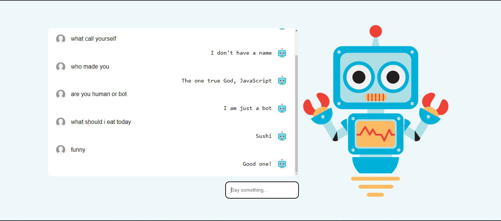

# JavaScript Chatbot 

This is a simple chatbot that uses JavaScript to interact with the user. The chatbot will ask the user for their message and then greet them. The chatbot will then ask the user for their age and respond with a message based on the user's age.

## Technologies Used

- HTML
- CSS
- JavaScript
- Bootstrap
- jQuery
- Google Fonts
- Font Awesome
- Git
- GitHub
- Visual Studio Code
- Command Line
- Markdown

## Features

- User can input their message
- User can receive a greeting message

## Preview

